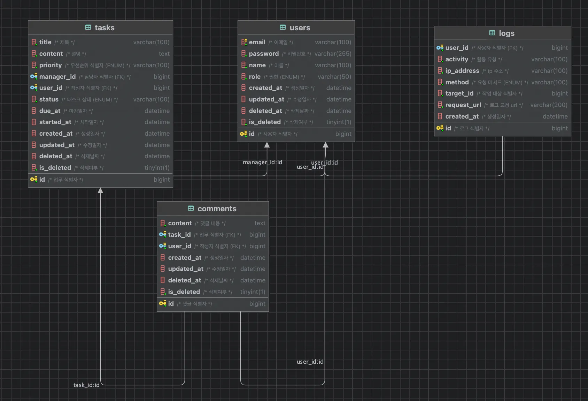

# 💫 아웃소싱 API

## 🎀 프로젝트 소개

아웃소싱 형태로 진행된 백엔드 프로젝트입니다. 

클라이언트 측에서 프론트엔드 개발을 완료한 상태에 참여하였으며,

REST API 기반으로 프론트엔드와 안정적으로 연동되는 백엔드 서버를 설계 및 구축하였습니다.

요구사항 분석부터 API 설계, 예외처리까지 전바적인 서버 개발을 수행한 프로젝트입니다.

> **내일배움캠프 1조**
> 
> **개발기간 : 2025-06-13 ~ 2025-06-20**

## 🧰 기술 스택

## 🖼️ ERD

## 📜 API 명세서 

API 명세서는 [OutSourcing Project API 문서](https://teamsparta.notion.site/API-2112dc3ef51480a9a21cf45c77d1e85f)를 클릭해주세요

## 👥  Team Member

- **이의현 (팀장)**  
  테스크 도메인 전반 (테스크 생성, 수정 ,조회, 상태변경, 삭제) 담당  
  GitHub: [leeuihyun](https://github.com/leeuihyun)

- **이동근 (팀원)**  
  회원 도메인 전반 (회원가입, 로그인, 유저 조회, JWT 인증) 담당  
  GitHub: [DG0702](https://github.com/dg0702)

- **김두하 (팀원)**  
  댓글 도메인 전반 (댓글 생성, 수정, 조회(검색), 삭제) 담당  
  GitHub: [doohaaa](https://github.com/doohaaa)

- **김민성 (팀원)**  
  대시보드 도메인 전반 (통계 정보 제공, 내 테스크 요약) 담당  
  GitHub: [urzn](https://github.com/urzn)

- **우새빛 (팀원)**  
  활동로그 도메인 전반 (주요 활동 기록, 활동 로그 조회) 담당  
  GitHub: [saevit](https://github.com/saevit)

## ✨ 주요 기능

- **docker를 이용하여 프론트엔드와 연결**

- **프론트엔드, 백엔드의 연결 → 연동 검증 : 브라우저에서 실제 요청/응답 확인**

## 🪄 트러블 슈팅

### USER 도메인 

- **406 ERROR (회원가입, 로그인)**

  - **응답 할 때 OffsetDateTime 역직렬화 불가 → 의존성을 추가하여 해결**

- **JWT 예외처리**

  - **`@ControllerAdvice`를 이용한 JWT 예외를 원하는 응답 형태로 변경 → Controller 보다 먼저 실행 되어 수동으로 응답 형태 생성**

- **CORS**

  - **docker 이용하여 프론트엔드 연결 후 백엔드 로직 실행 → CORS 문제 발생하여 CORS 설정하여 해결**

### TASK 도메인

- **DB 정규화 지키기 위한 과도한 설계**

  - **불필요하게 테이블의 복잡성 상승 → Enum을 사용하여 불필요한 분리를 줄이고 타입의 안정성 상승**

- **TestCode**

  - **테스트 코드 작성하여 Sturbing 후 실행하였지만 값을 반환하지 않음**

    - **반환값을 직접 지정하여 해결**

### COMMNET 도메인

- **협업의 어려움**

  - **각 도메인 파트별로 개발 → 나중에 연관이 있는 부분을 공통적으로 통일해야하는 문제 발생**

  - **팀원과 소통하며 기본적인 틀에서 조금씩 수정하여 해결**

- **프론트엔드 API를 이용한 개발의 어려움**

  - **API 설계를 도메인 위주로 하였으나 프론트 엔드 API와 달라 기능이 구현되지 않음**

  - **프론트엔드 API에 맞추어 API를 일부 수정하여 해결**

### DASHBOARD

- **Priority task 정렬**
 
  - **Priority`(Enum)` high-medium-low로 정렬하기 위해 `Enum`에 정수 필드를 추가 방식과 `Map<>`을 사용하여 정렬하는 방식을 고민**

  - **`Map<>`을 사용하는것으로 결정 → 순서를 정렬하는 로직이 이 경우밖에 없어서 결정**

    - **추가적으로 순서를 정렬하는 로직이 있을 경우 `Enum`에 정수 필드를 추가하여 사용하는 방향으로 선택**

### LOG

- **AOP 도입 및 책임 분리의 어려움**

  - **로직 분리의 기준을 정하는데 어려움 → 공통 처리와 비즈니스 로직 사이의 경계가 모호**

  - **AOP → 요청 메서드, URL, 로그인 한 유저ID 공통 정보 추출**

    - **추출한 데이터를 서비스 계층으로 전달하여 가공 및 DB 저장을 담당하도록 구조 설계함**

   

